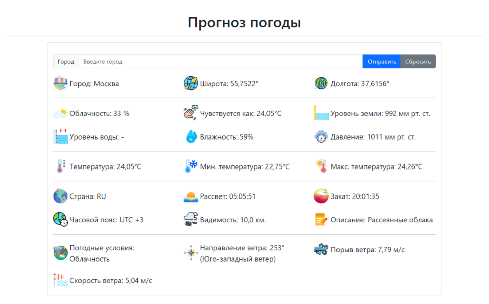

<h1 align="center">WeatherForecast</h1>

<h2 align="center">
    
    
    
    
</h2>

## Installation
- Clone the repository:  `git clone https://github.com/gaziikk/WeatherForecast.git`
- Create a virtual environment:  `python -m venv venv`
- Activate the virtual environment:  `venv/scripts/activate`
- Navigate to the project directory:  `cd weather_forecast`
- Install dependencies:  `pip install -r requirements.txt`
- Run the application:  `python manage.py runserver`

## Obtaining an API Key
- Visit [https://openweathermap.org/](https://openweathermap.org/) and sign up for a free account.
- Obtain your API key from your account dashboard.

## Environment Configuration

- Create a `config.py` file within the weather_forecast app directory.
- Add the following line to the `config.py` file:
    ```python
    open_weather_token = 'YOUR_API_KEY'
    ```
    
## Using Weather Forecast
- Run the project with the command `python manage.py runserver`
- Enter the name of the city in the appropriate input field.
- Weather Forecast will receive and display detailed weather information for this city using the OpenWeatherMap API.

## Short description
Web application that demonstrates the use of the OpenWeatherMap API to obtain and display up-to-date weather data.

## Media materials
<p align="center">
    
    
    
</p>
